# Azure PaaS Handson (#1 Infra Beginner)

## 概要

### 目的

ハンズオンを通してPaaS利用時の基本的なネットワーク構成およびその実現方法を学びます。


### 対象

以下のような方を対象として想定しています。

* クラウド管理者​
* クラウドアーキテクト​
* ネットワークエンジニア​
* セキュリティ管理者​
* セキュリティアーキテクト


### 前提条件

* ネットワーク知識


### 目次

  1. [Exercise1：ネットワーク作成](#exercise1ネットワーク作成)
  2. [Exercise2：安全なアクセス](#exercise2安全なアクセス)
  2. [Exercise3：SQL Database作成](#exercise3sql-database作成)
  3. [Exercise4：App Service作成](#exercise4app-service作成)
  4. [Exercise5：Key Vault作成](#exercise5key-vault作成)

  * [事前準備](./handson-prepare.md)


---

## ハンズオン

### 事前準備された環境の確認

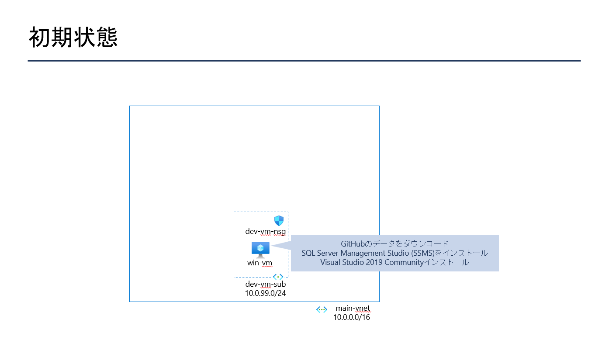

事前準備された環境には以下のリソースが配置されています。

* ソースコード、データなどの確認

      ```
      Documents
        `- handson-paas-webapp
            |- app      Webアプリケーション本体
            `- data     SQL Server へ投入するデータ
      ```

* インストール済みアプリケーション
    * Visual Studio 2022 Community Edition
    * SQL Server Management Studio


### Exercise1：ネットワーク作成

これから作成する環境の基本となるネットワーク構成を作成していきます。

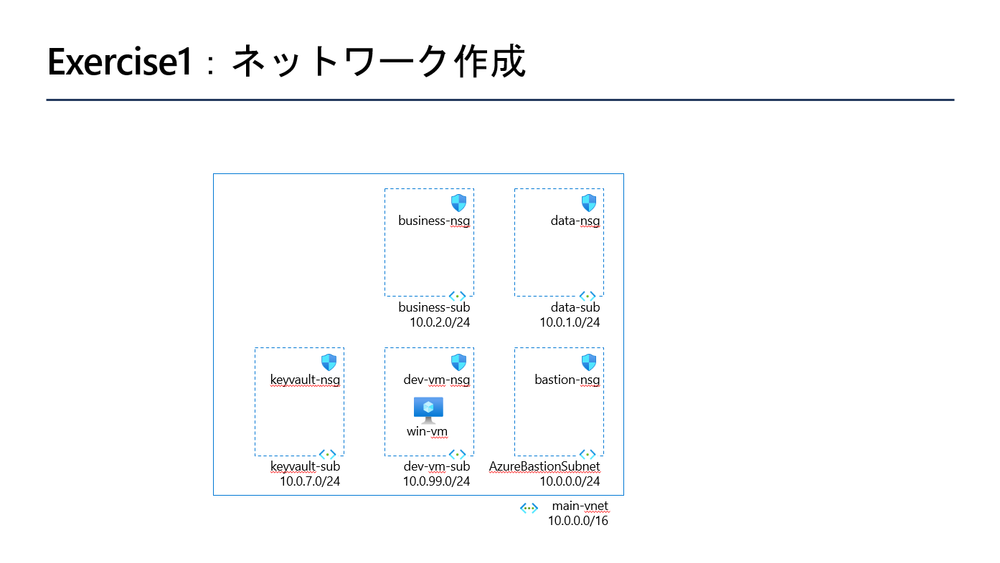

**●仮想ネットワークの作成**

1. ポータル上部の検索窓から `VNet` を検索、「仮想ネットワーク」を選択

2. [作成]を選択

3. 仮想ネットワークの作成

    1. 基本

        * リソースグループ： `handson-lab-rg`
        * 名前： (任意)
        * 地域： `Japan East`

        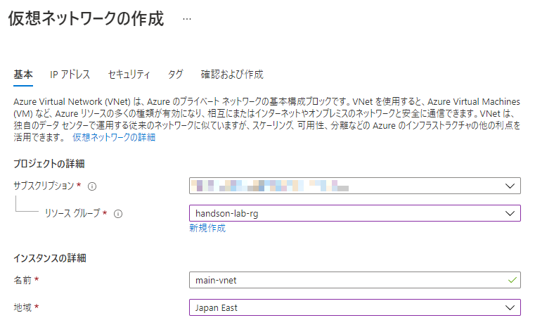

    2. IPアドレス

        * VNet自体のアドレス空間が `10.0.0.0/16` になっていることを確認
        * サブネットの「default」を削除
        * [サブネットの追加] から以下のサブネットを作成

            | サブネット名    |アドレス範囲  |
            |----------------|-------------|
            |`AzureBastionSubnet`|`10.0.0.0/24`|
            |`data-sub`     |`10.0.1.0/24`|
            |`business-sub` |`10.0.2.0/24`|
            |`keyvault-sub` |`10.0.7.0/24`|

        

    3. セキュリティ

        * すべて「無効化」<br />
          （あとから Bastion を作成する）

    4. 確認および作成

**●ネットワークセキュリティグループ（NSG）作成**

1. ポータル上部の検索窓から `nsg` を検索、「ネットワークセキュリティグループ」を選択

2. [作成]を選択

3. ネットワークセキュリティグループの作成（`business-nsg` の作成）

    1. 基本

        * リソースグループ： `handson-lab-rg`
        * 名前： `business-nsg`

        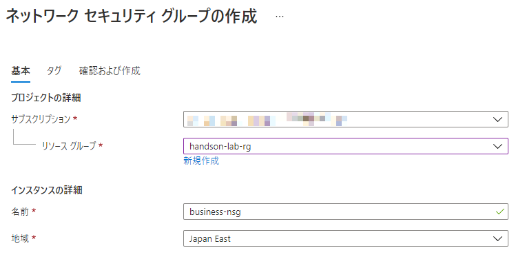

    2. 確認および作成

        * 内容を確認して「作成」を選択、リソースを作成

4. ポータル上部の検索窓から `nsg` を検索、「ネットワークセキュリティグループ」を開く

5. 作成済みの `business-nsg` を選択

    1. [設定]-[サブネット]を開く
    2. [関連付け]を選択
    3. 作成済みの `business-sub` を設定して「OK」を選択

    6. [設定]-[受信セキュリティ規則]を開く
    7. [追加]を選択
    8. 以下の受信規則（インバウンド）を追加

        |優先度|名前               |ポート|プロトコル|ソース|宛先|アクション|
        |------|------------------|-----|---------|-----|----|---------|
        |100   |AllowHttpInBound  |80    |TCP      |Any  |Any |Allow    |
        |110   |AllowHttpsInBound |443   |TCP      |Any  |Any |Allow    |

<!--
     9. [設定]-[送信セキュリティ規則]を開く
    10. [追加]を選択
    11. 以下の送信規則（アウトバウンド）を追加

    |優先度|名前                     |ポート|プロトコル|ソース|宛先|アクション|
    |------|------------------------|-----|---------|-----|----|---------|
    |100   |AllowSQLServerOutBound  |80    |TCP      |Any  |Any |Allow    |
-->

6. 3~5を繰り返して残りのネットワークセキュリティグループも作成

* `data-nsg`
    * インバウンド
        （規則なし）
    * アウトバウンド
        （規則なし）
* `keyvault-sub`
    * インバウンド
        （規則なし）
    * アウトバウンド
        （規則なし）
* `bastion-nsg`
    * インバウンド

        |優先度|名前                        |ポート|プロトコル|ソース|宛先|アクション|
        |------|----------------------------|-----|---------|-----|----|---------|
        |100   |AllowHttpsInBound           |443   |TCP    |Internet  |Any |Allow    |
        |110   |AllowGatewayManagerInBound  |443    |TCP  |GatewayManager  |Any |Allow    |
        |120   |AllowAzureLoadBalancerInBound|443   |TCP   |AzureLoadBalancer  |Any |Allow    |
        |130   |AllowBastionHostCommunication|8080,5701 |Any  |VirtualNetwork |VirtualNetwork |Allow|

    * アウトバウンド

        |優先度|名前               |ポート|プロトコル|ソース|宛先|アクション|
        |------|------------------|-----|---------|-----|----|---------|
        |100   |AllowSshRdpOutBound  |22,3389    |Any      |Any  |VirtualNetwork |Allow    |
        |110   |AllowAzureCloudOutBound |443   |TCP      |Any  |AzureCloud |Allow    |
        |120   |AllowBastionCommunication|8080,5701 |Any  |VirtualNetwork |VirtualNetwork |Allow|
        |130   |AllowGetSessionInformation |80   |Any      |Any  |Internet |Allow    |

### Exercise2：安全なアクセス

**●Just-In-Time アクセス**

1. Defender for Cloud の有効化

    1. ポータル上部の検索から `defender` を検索、 「Microsoft Defender for Cloud」 を選択

    2. [管理]-[環境設定] を開く

    3. 保護したいサブスクリプションを選択

    4. 「すべて有効にする」を選択

        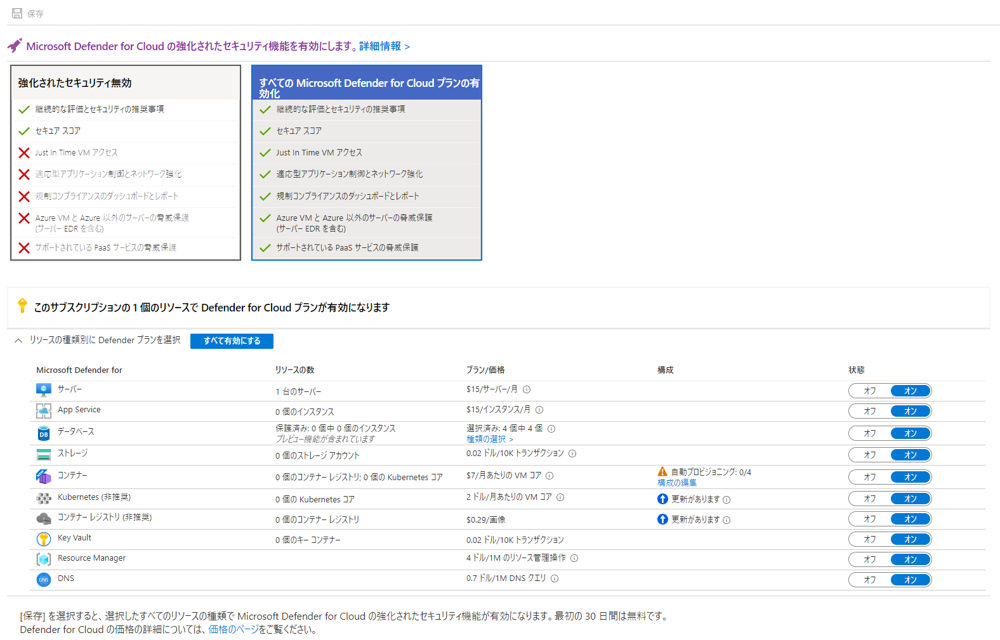

    5. 左上の「保存」を選択

2. Just-In-Time の設定

    1. ポータル上部の検索から `defender` を検索、 「Microsoft Defender for Cloud」 を選択

    2. [クラウドセキュリティ]-[ワークロード保護]を選択

    3. 「Just-In-Time VM アクセス」を選択

    4. 「仮想マシン」の「構成されていません」タブへ移動

    5. `win-vm` を選択して「1台のVMでJITを有効にする」を選択

        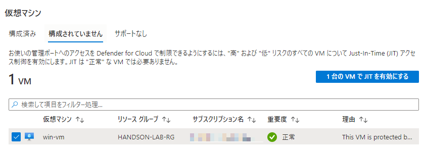


    (参考) Defender for Cloud の一覧に表示されていない場合、以下の手順で個別にVM側から設定することも可能です。

    1. ポータル上部の検索から `vm` を検索、 「Virtual Machines」 を選択

    2. `win-vm` を選択

    3. [設定]-[構成]を開く

    4. 「Just-in-Time を有効にする」を選択

        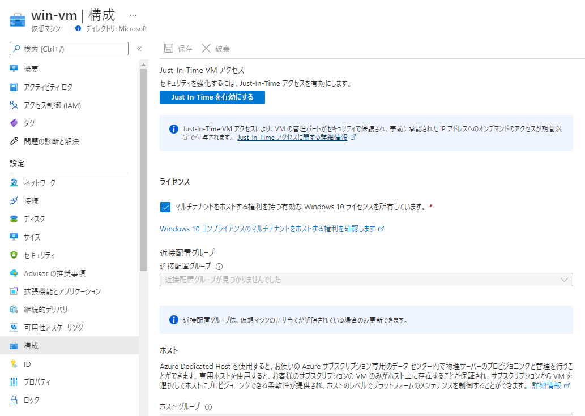

3. Just-In-Time アクセスを利用した接続

    1. ポータル上部の検索から `vm` を検索、 「Virtual Machines」 を選択

    2. `win-vm` を選択

    3. [設定]-[接続]を開く

    4. RDPタブで「接続元IPアドレス」として「自分のIP」を選択して「アクセス権の要求」を選択

        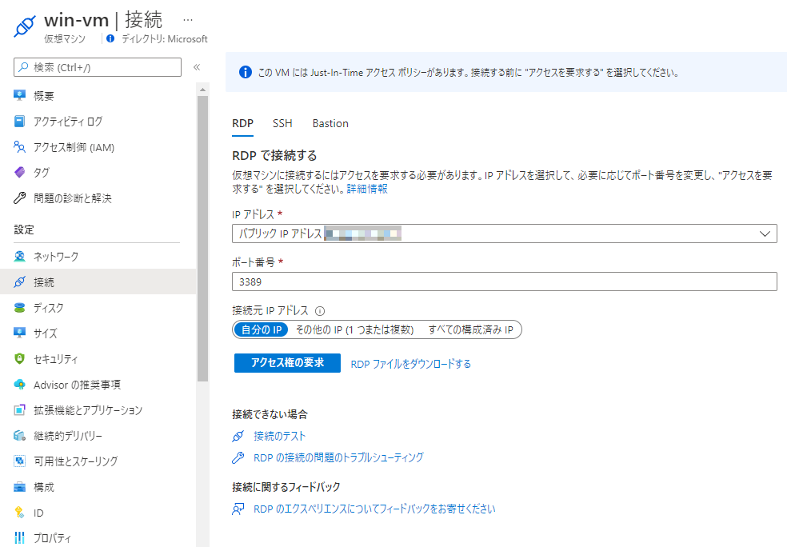

    5. 「RDPファイルのダウンロード」を押下してRDPファイルを取得

    6. ダウンロードした RDPファイル を使って仮想マシンへアクセス

        (*) ログインに必要なユーザー名、パスワードは担当者へご確認お願いします。

**●Bastion**

1. Bastion の構築

    1. ポータル上部の検索から `bastion` を検索、 「Bastion」 を選択

    2. 左上「作成」を選択

    3. Bastionの作成

        1. 基本

            * リソースグループ： `handson-lab-rg`
            * 名前： (任意)
            * 地域： (リソースグループと同じ)
            * 仮想ネットワーク： `main-vnet`
            * サブネット： `AzureBastionSubnet` (サブネット名は固定)
            * パブリックIP： 新規作成

            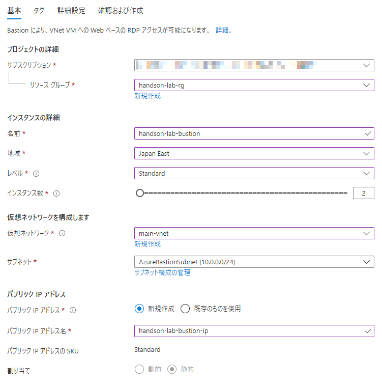

        2. タグ

            特に設定せず次へ

        3. 詳細設定

            「ネイティブクライアントサポート（プレビュー）」にチェック

            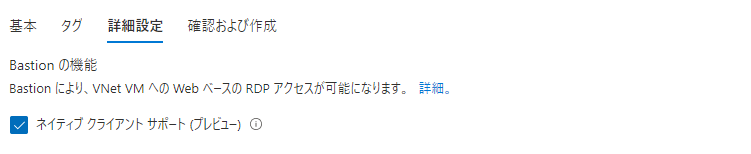

        4. 確認および作成

            作成内容を確認して「作成」

2. Bastion を利用した接続

    1. ポータル上部の検索から `vm` を検索、 「Virtual Machines」 を選択

    2. `win-vm` を選択

    3. [操作]-[Bastion]を開く

    4. 「新しいウィンドウで開く」にチェックを入れ、「ユーザー名」「パスワード」を入力して「接続」を選択
    
        (*) ポップアップブロックされた場合、「許可」して再度実行する

        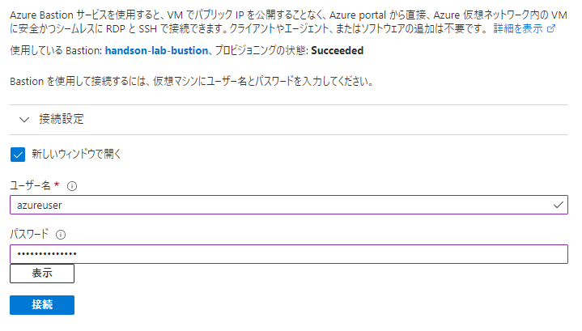


    (参考) ローカルに az コマンドがインストールされている場合、以下のコマンド(PowerShell)でネイティブログインが可能。

    ```
    $SUBSCRIPTION_ID="<YOUR_SUBSCRIPTION_ID>"
    $RESOUCE_GROUP_NAME="handson-lab-rg"
    $BASTION_NAME="<YOUR_BASTION_NAME>"
    $VM_NAME="win-vm"
    $VM_ID=/subscriptions/$SUBSCRIPTION_ID/resourceGroups/$RESOUCE_GROUP_NAME/providers/Microsoft.Compute/virtualMachines/$VM_NAME

    az login
    az account set -s $SUBSCRIPTION_ID
    az network bastion rdp --name "$BASTION_NAME" --resource-group "$RESOUCR_GROUP_NAME" --target-resource-id "$VM_ID"
    ```


### Exercise3：SQL Database作成

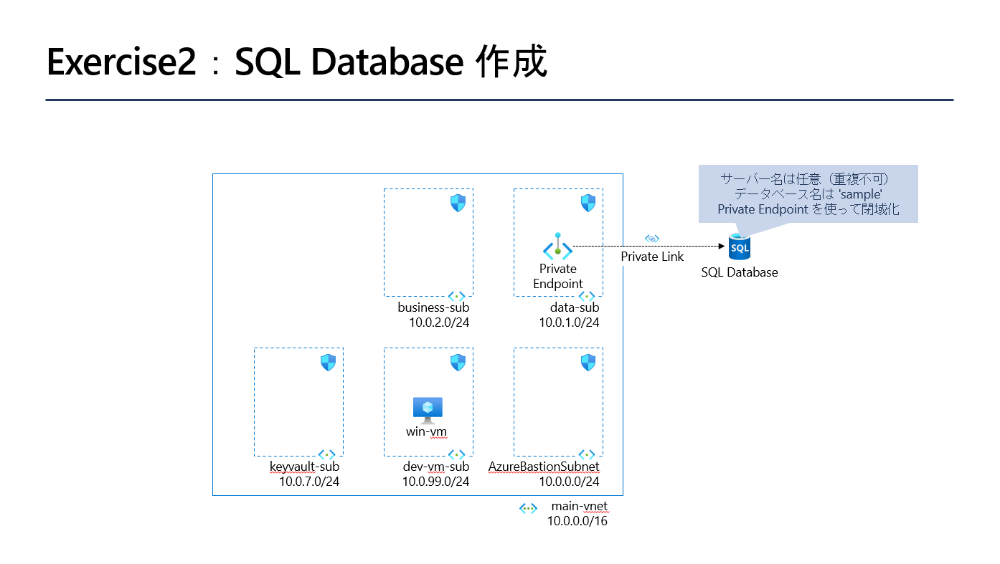

1. ポータル上部の検索窓から `sql` を検索、「SQL データベース」を選択

2. 左上「作成」を選択

3. SQL データベースの作成

    1. 基本

        * リソースグループ： `handson-lab-rg`
        * データベース名： `sample`
        * サーバー： （新規作成）

            * サーバー名：（任意。ただしグローバルで重複不可）
            * 場所： 東日本（リソースグループの設定にあわせる）
            * 認証： "SQL 認証を使用する" にして ID/PASSWORD を指定

            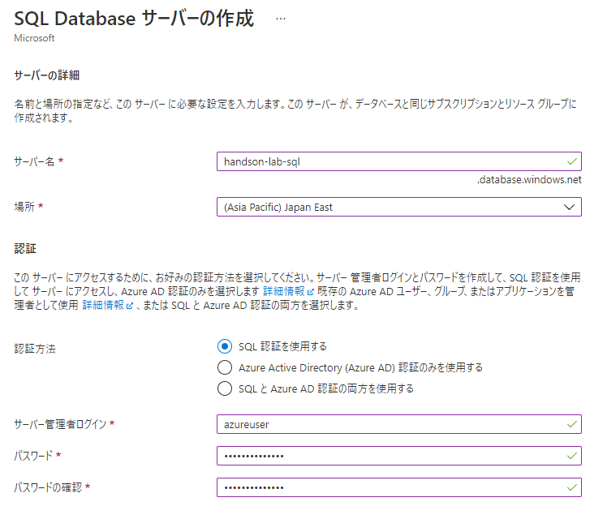

        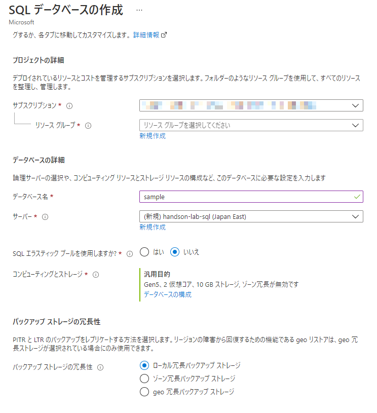

    2. ネットワーク

        * ネットワーク接続

            「プライベートエンドポイント」を選択して「プライベートエンドポイント」を追加

            * 場所：東日本（リソースグループの設定にあわせる）
            * ネットワーク： `data-sub` (SQL Database 用のサブネットを指定)
            * プライベートDNS統合： DNS統合する

            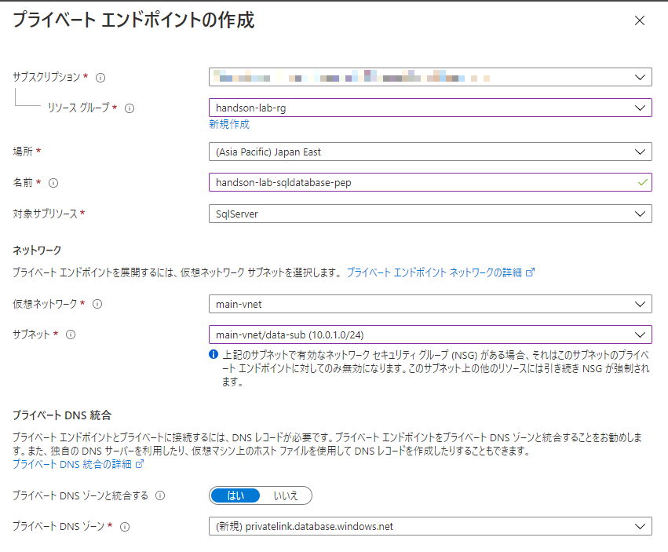

    3. セキュリティ

        Microsoft Defender for SQL を「後で」に変更

    4. 追加設定

        * データベース照合順： `Japanese_CI_AS`

    5. 確認および作成

        内容を確認して「作成」を選択、リソースを作成

4. SQLデータベース の設定

    1. SQL Server から作成した SQL Server を選択
    2. [セキュリティ]-[ファイアウォールと仮想ネットワーク]を開く
    3. 「パブリック ネットワークアクセスの拒否」を選択して「保存」

        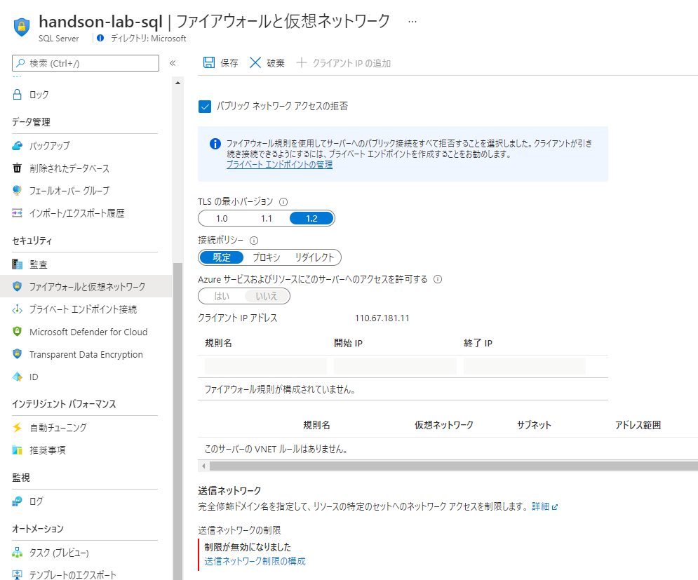


5. SQLデータベースへデータ投入

    1. 開発仮想マシンへ入る
    2. "SQL Server Management Studio" を開く
    3. SQL認証でSQLサーバーへ接続

        |項目          |値|
        |--------------|---|
        |サーバーの種類 |データベースエンジン|
        |サーバー名     |（作成した SQLデータベース の [概要] から "サーバー名" を取得）|
        |認証           |SQL Server 認証|
        |ログイン       |（作成したもの）|
        |パスワード     |（作成したもの）|

    4. テーブルの作成

        ```
        handson-paas-webapp\data
          `- CREATE_TABLE.sql
        ```

    5. データ投入

        ```
        handson-paas-webapp\data
          |- INSERT_DATA_PREFECTURES.sql`
          `- INSERT_DATA_WORK.sql
        ```


### Exercise4：App Service作成

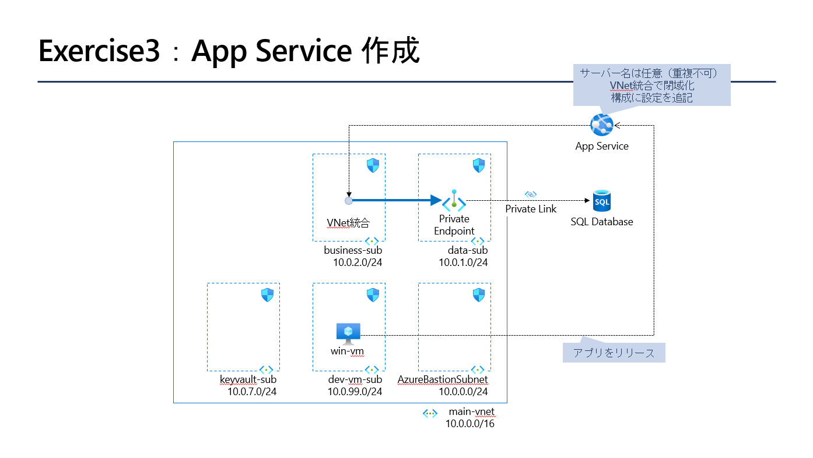

1. App Service プラン 作成

    * 名前：（任意）
    * オペレーティングシステム： Windows
    * 地域：東日本（リソースグループと同じリージョンを選択）
    * 価格レベル： Standard S1 （Private Endpoint ）

    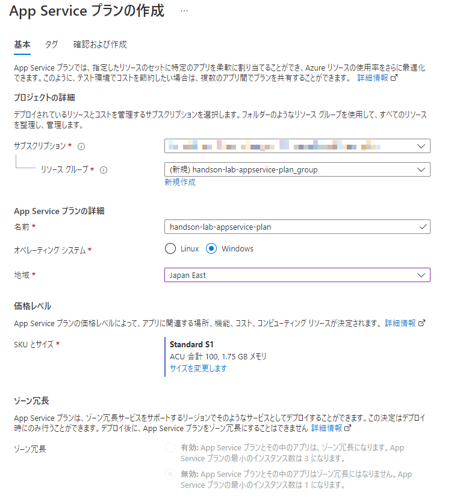


2. App Service 作成

    1. 基本

        * 名前： 任意（グローバルで重複しないよう設定）
        * 公開： コード（今回はソースコードをリリースする）
        * ランタイムスタック： .NET 5
        * オペレーティングシステム： Windows
        * 地域（リージョン）： 東日本（リソースグループとあわせる）
        * App Service プラン： （前手順で作成したものを指定）

        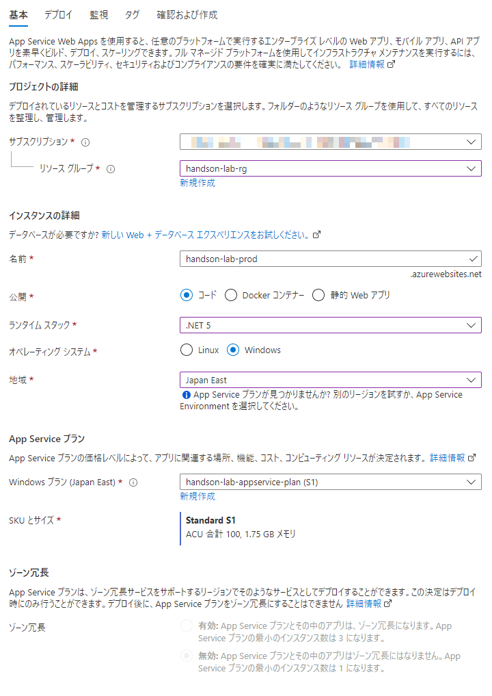

    2. デプロイ

        * 継続的なデプロイ： 無効化

        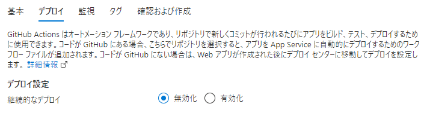

    3. 監視

        * Application Insights を有効にする： いいえ

        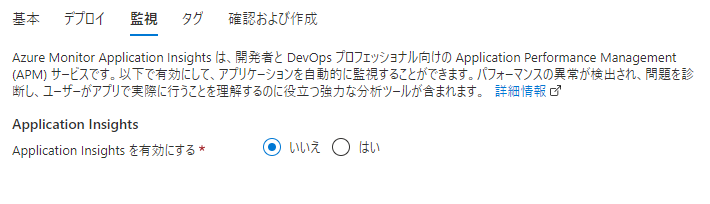

    4. 確認および作成

        内容を確認して「作成」を選択、リソースを作成

3. App Service を VNETへ統合

    1. 作成した App Service を開く

    2. [設定]-[ネットワーク]を開く

    3. 「送信トラフィック」にある「VNET統合」を選択

    4. 「VNetの追加」を選択

    5. 作成済みの `business-sub` を選択して「OK」

        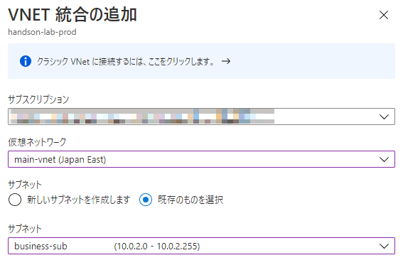


4. アプリケーションのリリース

    1. 仮想マシンへ接続

    2. Visual Studio を起動
        `Documents\handson-paas-webapp-main\app` にある ソリューションファイル を開く

    3. ソリューションエクスプローラーでプロジェクト名を右クリック、「発行」を選択

        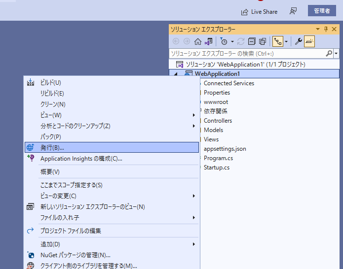

    4. ターゲットは「Azure」を選択

        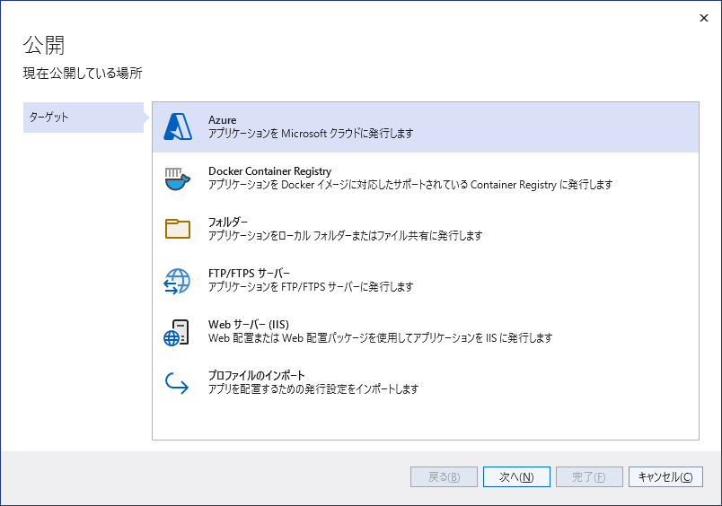

    5. 特定のターゲットは「Azure App Service (Window)」を選択

        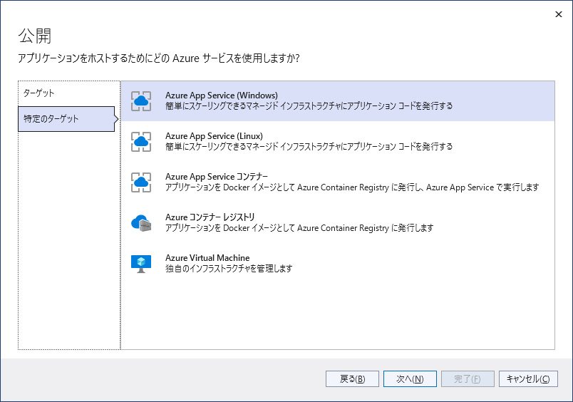

    6. サインインを行う

        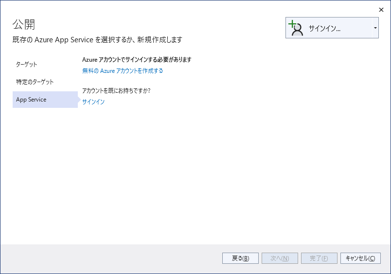

    7. リリース先を選択

        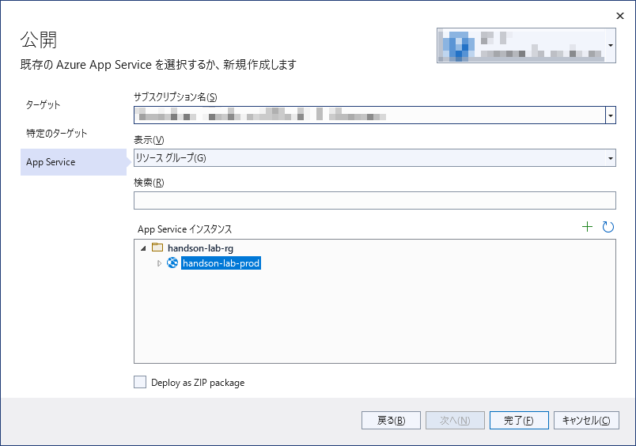

    8. 「発行」を選択

        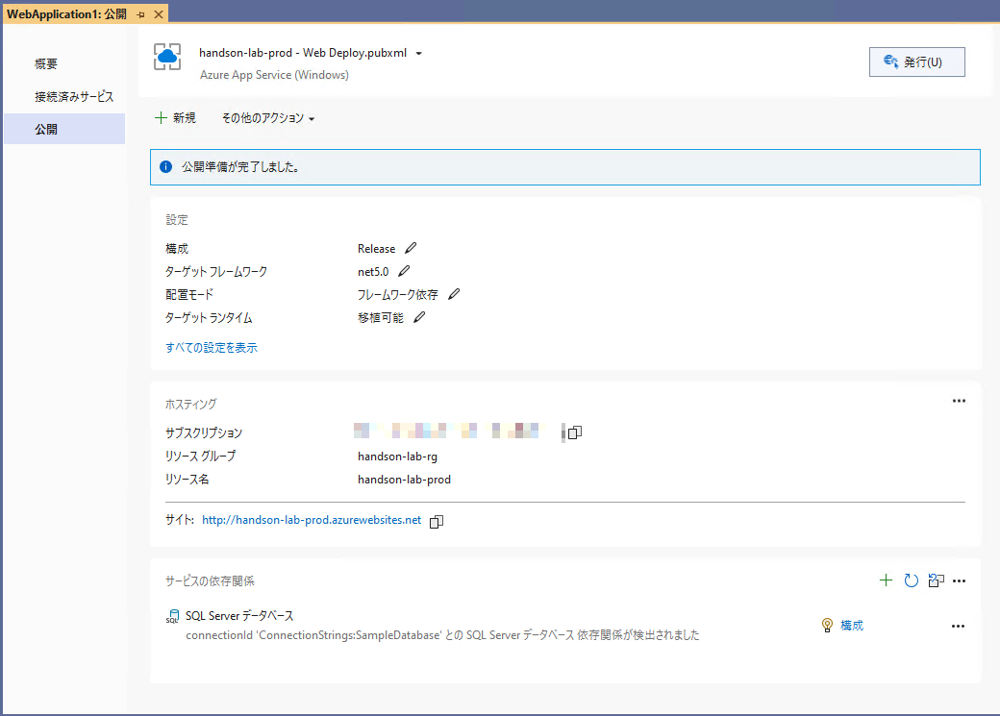

    9. 自動でブラウザが立ち上がるのでリリースされていることをを確認


4. App Service にDBへの接続情報を追加

    1. SQLデータベースへの接続文字列を取得

        1. Azureポータルで "SQL データベース" を開く

        2. 作成したデータベースを開く

        3. [設定]-[接続文字列]を開く

        4. 「ADO.NET」のタブにある接続文字列を取得

            `{your_password}` の部分をご自身で設定したパスワードに修正<br />
            後から使うのでメモとして取っておく

    2. App Service を開く

        1. [設定]-[構成]を開く

        2. 「接続文字列」に新しい接続文字列を追加

            |名前               |値 |
            |------------------|---|
            | `SampleDatabase` | `Server=tcp:<SQL_SERVER_NAME>.database.windows.net,1433;Initial Catalog=sample;Persist Security Info=False;User ID=<USER_NAME>;Password=<PASSWORD>;MultipleActiveResultSets=False;Encrypt=True;TrustServerCertificate=False;Connection Timeout=30;`|

            > note
            > 
            > `SampleDatabase` は ASP.NET プロジェクトに含まれる appsettings.json で定義した変数名
            > 

        3. 「保存」を選択<br />
            アプリケーションが自動で再起動する。


5. 動作確認

    1. 作成した App Service を開く

    2. [概要]に表示される「URL」を確認

    3. インターネットへつながる任意の環境でブラウザを立ち上げ、 App Service で確認したURLへアクセス<br />
        接続ができていれば「Search」を開いたときに検索結果が表示される。

        


### Exercise5：Key Vault作成

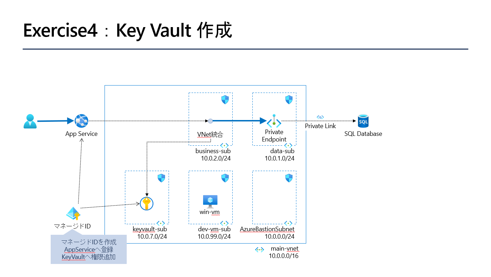

1. マネージドID 作成

    1. ポータル上部の検索窓から `マネージドID` を検索、「マネージドID」を選択

    2. 「作成」を選択

    3. ユーザー割り当てのマネージドIDの作成

        1. 基本

            * リソースグループ： `handson-lab-rg`
            * 地域： (リソースグループと同じ)
            * 名前： (任意)

            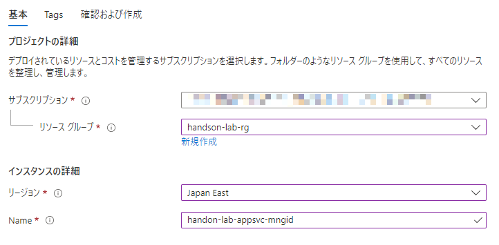

        2. 確認および作成

            内容を確認して「作成」を選択、リソースを作成


2. Key Vault 作成

    1. ポータル上部の検索窓から `key` を検索、「キーコンテナ」を選択

    2. 「作成」を選択

    3. キーコンテナーの作成

        1. 基本

            * リソースグループ： `handson-lab-rg`
            * Key Vault 名： (任意)
            * 地域（リージョン）： (リソースグループと同じ)

            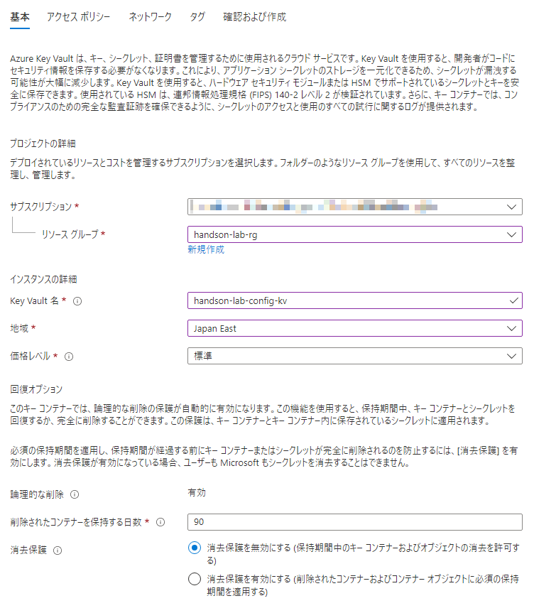

        2. アクセスポリシー、ネットワークは後から設定するのでスキップ

        3. 確認および作成

            内容を確認して「作成」を選択、リソースを作成

3. Key Vault の設定（接続文字列の登録、アクセスポリシーの設定、閉域化）

    1. 接続文字列の設定

        1. 作成したキーコンテナを開く

        2. [設定]-[シークレット]を開く

        3. 「生成/インポート」を選択

        4. シークレットの作成

            * 名前： (任意)
            * 値： (App Service に登録した ConnectionString を設定)

            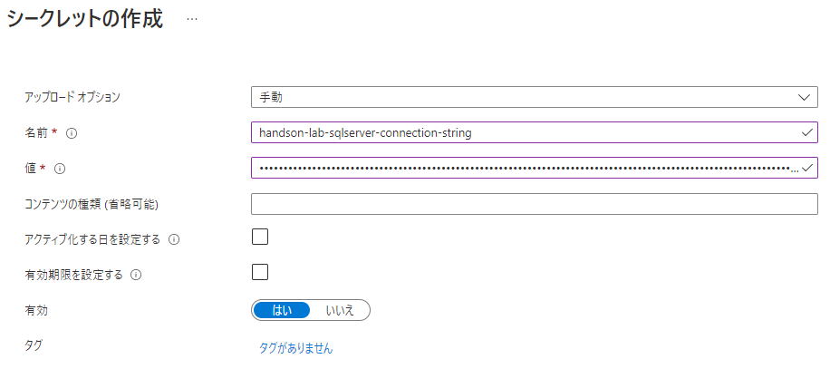

    2. アクセスポリシー

        1. 作成したキーコンテナを開く

        2. [設定]-[アクセスポリシー]を開く

        3. 「アクセスポリシーの追加」を選択

        4. アクセスポリシーの追加

            |項目|設定|
            |---|---|
            |キーのアクセス許可         | (なし) |
            |シークレットのアクセス許可 | 取得 |
            |証明書のアクセス許可       | (なし) |
            |プリシンパルの選択         | (作成したマネージドIDを選択) |

            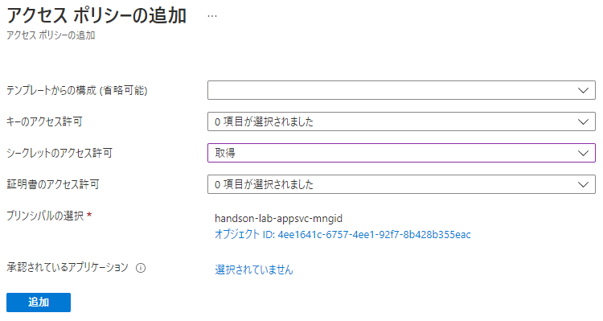
        
        5. 「保存」を選択（ **保存し忘れ注意** ）

    3. ネットワーク

        1. 作成したキーコンテナを開く

        2. [設定]-[ネットワーク]を開く

        3. 「プライベートエンドポイント接続」タブを選択

        4. 「作成」を選択

        5. プライベートエンドポイントを作成する

            1. 基本

                * リソースグループ： `handson-lab-rg`
                * 名前： (任意)
                * 地域： (リソースグループと同じ)

                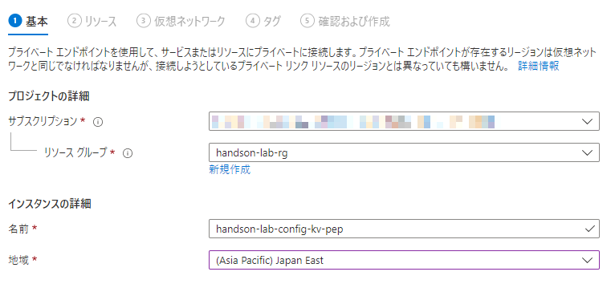

            2. リソース

                * リソースの種類： `Microsoft.KeyVault/vaults`
                * リソース： (作成した KeyVault の名前)
                * 対象サブリソース： `vaults`

                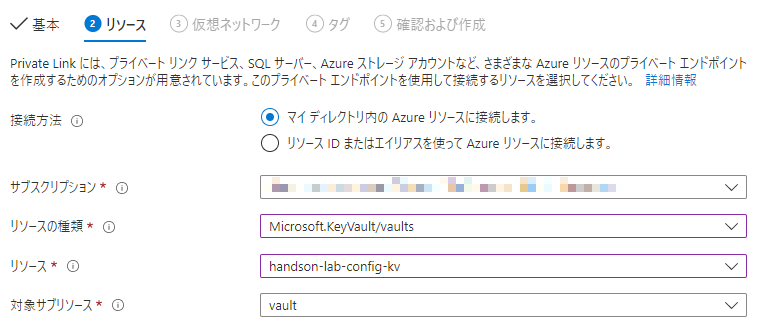
            
            3. 仮想ネットワーク

                * 仮想ネットワーク： `main-vnet`
                * サブネット： (KeyVault用に作成したサブネットを指定)
                * プライベートIP構成： IPアドレスを動的に割り当てる
                * プライベートDNS統合： プライベートDNSゾーンと統合する「はい」

                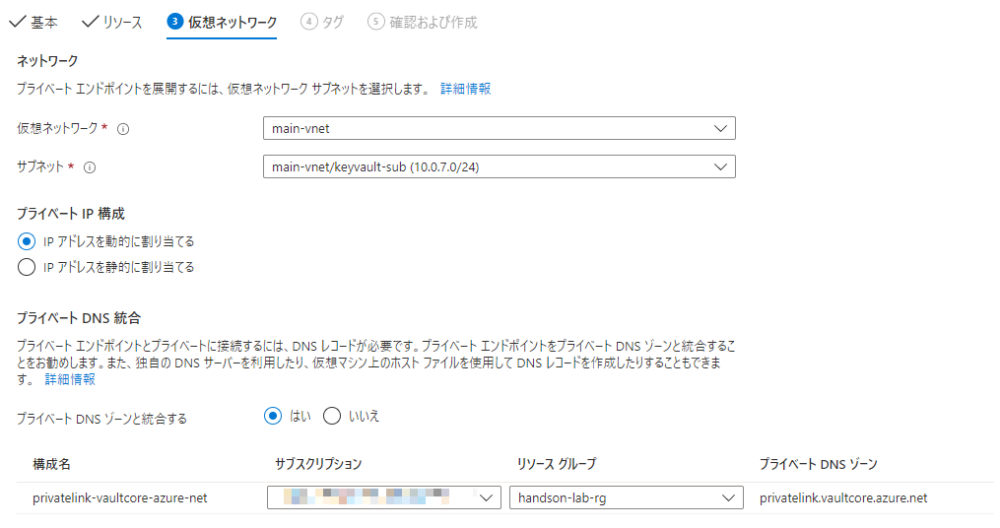
            
            4. 確認と作成

                内容を確認して作成

            > note
            > 
            > 「プライベートエンドポイント」を設定すると外部から KeyVault へアクセスできなくなる。
            > 操作するためには仮想ネットワーク内の作業用VMからアクセスする必要がある。
            > 

        6. [設定]-[ネットワーク]を開く

        7. 「ファイアウォールと仮想ネットワーク」タブを選択

            1. 「選択されたネットワーク」を選択

            2. 仮想ネットワークの「既存の仮想ネットワークを追加」を選択し、以下のサブネットを追加

                * dev-vm-sub (開発VMの存在するサブネット)
                * business-sub (App Service のVNet統合をしたサブネット)

                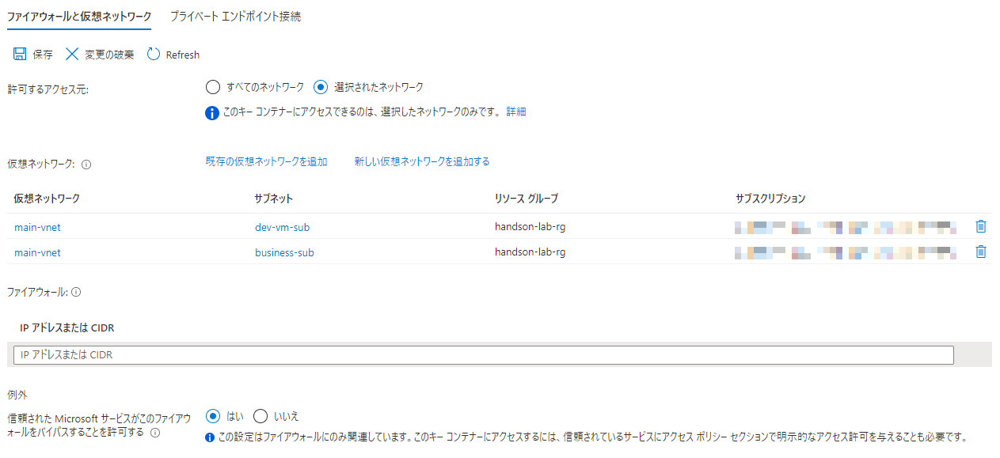


4. App Service の設定（マネージドIDの設定、KeyVaultの参照）

    1. マネージドIDの利用設定

        1. 作成した App Service を開く

        2. [設定]-[ID] を開く

        3. 「ユーザー割り当て済み」タブへ移動

        4. 「追加」を選択

        5. 作成した「マネージドID」を選択、「追加」を選択

            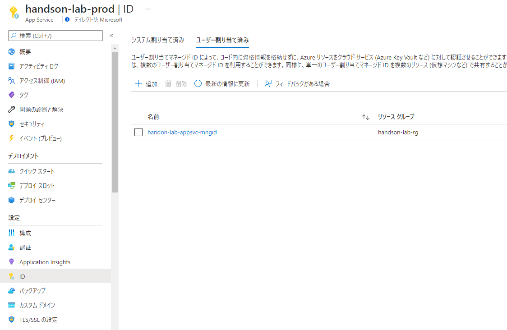

        6. Cloudシェルを起動して以下のコマンドを実行<br />
            KeyVaultを参照するときに使うIDがマネージドIDになるよう修正

            ```
            RESOURCE_GROUP_NAME=<YOUR_RESOURCE_GROUP_NAME>
            MANAGED_ID_NAME=<YOUR_MANAGED_ID_NAME>
            APP_SERVICE_NAME=<YOUR_APP_SERVICE_NAME>

            userAssignedIdentityResourceId=$(az identity show -g ${RESOURCE_GROUP_NAME} -n ${MANAGED_ID_NAME} --query id -o tsv)
            appResourceId=$(az webapp show -g ${RESOURCE_GROUP_NAME} -n ${APP_SERVICE_NAME} --query id -o tsv)
            az rest --method PATCH --uri "${appResourceId}?api-version=2021-01-01" --body "{'properties':{'keyVaultReferenceIdentity':'${userAssignedIdentityResourceId}'}}"
            ```

    2. KeyVault の参照設定

        1. 作成した App Service を開く

        2. [設定]-[構成] を開く

        3. 「接続文字列」の `SampleDatabase` の行にある「編集」を選択

        4. 「値」を以下のように修正して「OK」

            |設定|値|
            |---|---|
            |名前| `SampleDatabase` |
            |値  | `@Microsoft.KeyVault(SecretUri=<SECRET_URI>)` |
            |種類| `SQLServer` |

            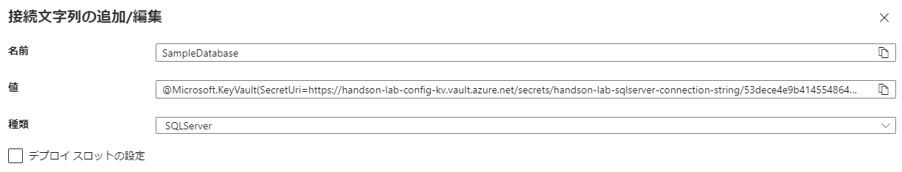

            > note
            > 
            > `<SECRET_URI>` は KeyVault から該当キーの詳細情報にある「シークレット識別子」を利用する
            > 1. [設定]-[シークレット] を開く
            > 2. 作成したシークレットを開く
            > 3. 「現在のバージョン」にある最新のものを選択
            > 4. 「シークレット識別子」にあるURLを取得
            > 
            > `<SECRET_URI>` の設定において `'"'(ダブルクォート)` で囲んだり、 `'{}'(波括弧)` で囲んだりすると正しく動作しないので注意する

        5. 「保存」を押下

        6. 正しく接続できれば「ソース」に「キーコンテナーの参照」が表示される

            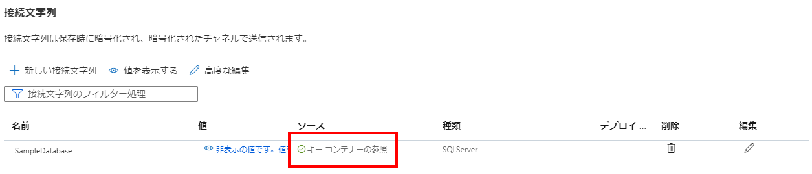


    5. 動作確認

        1. 作成した App Service を開く

        2. [概要]に表示される「URL」を確認

        3. インターネットへつながる任意の環境でブラウザを立ち上げ、 App Service で確認したURLへアクセス<br />
            接続ができていれば「Search」を開いたときに検索結果が表示される。

            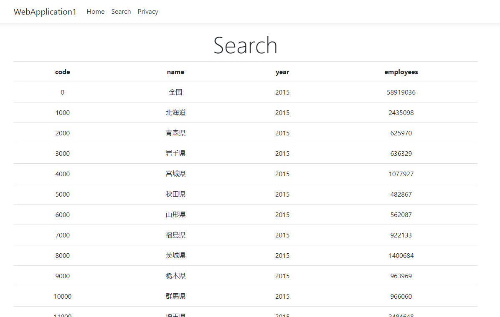


---
