# Azure PaaS Handson (#1 Infra Beginner)

## 概要

### 目的

ハンズオンを通してPaaS利用時の基本的なネットワーク構成およびその実現方法を学びます。


### 対象

以下のような方を対象として想定しています。

* クラウド管理者​
* クラウドアーキテクト​
* ネットワークエンジニア​
* セキュリティ管理者​
* セキュリティアーキテクト


### 前提条件

* ネットワーク知識


### 目次

  1. [Exercise1：App Service, SQL Database 作成](#exercise1app-service-sql-database-作成)
  2. [Exercise2：Webアプリケーションのデプロイ](#exercise2webアプリケーションのデプロイ)
  3. [Exercise3：App Service Private 化](#exercise3app-service-private-化)
  4. [Exercise4：SQL Database Private 化 & App Service VNet 統合](#exercise4sql-database-private-化--app-service-vnet-統合)
  5. [Exercise5：Key Vault 設定](#exercise5key-vault-設定)
  6. [Exercise6：（オプション）安全なアクセス](#exercise6オプション安全なアクセス)

  * [事前準備](./handson-prepare.md)


---

## ハンズオン

### 事前準備された環境の確認


事前準備された環境には以下のリソースが配置されています。

* ソースコード、データなどの確認

      ```
      Documents
        `- handson-paas-webapp
            |- app      Webアプリケーション本体
            `- data     SQL Server へ投入するデータ
      ```

* インストール済みアプリケーション
    * Visual Studio 2022 Community Edition
    * SQL Server Management Studio

### Exercise1：App Service, SQL Database 作成

AppService と SQL Database を作成します。 EndPoint は Public にしておき、外部からアクセス可能な状態にします。


1. App Service プラン 作成

    1. リソース作成画面
        
        


    * 名前：（任意）
    * オペレーティングシステム： Windows
    * 地域：東日本（リソースグループと同じリージョンを選択）
    * 価格レベル： Standard S1
    

2. App Service 作成

    1. 基本

        * 名前： 任意（グローバルで重複しないよう設定）
        * 公開： コード（今回はソースコードをリリースする）
        * ランタイムスタック： .NET 6 (LTS)
        * オペレーティングシステム： Windows
        * 地域（リージョン）： 東日本（リソースグループとあわせる）
        * App Service プラン： （前手順で作成したものを指定）
        

    2. デプロイ

        * 継続的なデプロイ： 無効化
        

    3. 監視

        * Application Insights を有効にする： いいえ
        

    4. 確認および作成

        内容を確認して「作成」を選択、リソースを作成

    5. デプロイ結果を確認
        
        

3. SQL Database 作成

    1. リソース検索

        * 「SQL Database」で検索
       　

    2. 基本

        * リソースグループ： `handson-lab-rg`
        * データベース名： `sample`
        * サーバー：新規作成（下記参照）
        * バックアップストレージの冗長性：ローカル冗長バックアップストレージ
        

        * サーバー： （新規作成）

            * サーバー名：（任意。ただしグローバルで重複不可）
            * 場所： 東日本（リソースグループの設定にあわせる）
            * 認証： "SQL 認証を使用する" にして ID/PASSWORD を指定
            


    3. ネットワーク

        * ネットワーク接続

            パブリック エンドポイントを選択

        * ファイアウォール規則

            「Azure サービスおよびリソースにこのサーバーへのアクセスを許可する」を「はい」
            

    4. セキュリティ

        * Microsoft Defender for SQL を「後で」に変更
        

    5. 追加設定

        * データベース照合順： `Japanese_CI_AS`
        

    6. 確認および作成

        内容を確認して「作成」を選択、リソースを作成

    7. デプロイ結果を確認
        * Azure Portal で作成したSQL Database を開き、概要からサーバー名を取得 
        

        * 開発仮想マシンへ入る
        * "SQL Server Management Studio" を開く
        * SQL認証でSQLサーバーへ接続

        | 項目           | 値                                                              |
        | -------------- | --------------------------------------------------------------- |
        | サーバーの種類 | データベースエンジン                                            |
        | サーバー名     | （作成した SQLデータベース の [概要] から "サーバー名" を取得） |
        | 認証           | SQL Server 認証                                                 |
        | ログイン       | （設定したもの）                                                |
        | パスワード     | （設定したもの）                                                |

        

        * sample データベースがあることを確認
        

### Exercise2：Webアプリケーションのデプロイ

まずは App Service と SQL Database の Endpoint が Public な状態で Web アプリケーションをデプロイし、稼動することを確認します。


1. SQL Database にテーブルとデータを作成する
    
    1. テーブルの作成

        * SSMS (SQL Server Management Studio)の sample データベースを選択した状態で「Open File」アイコンをクリック
        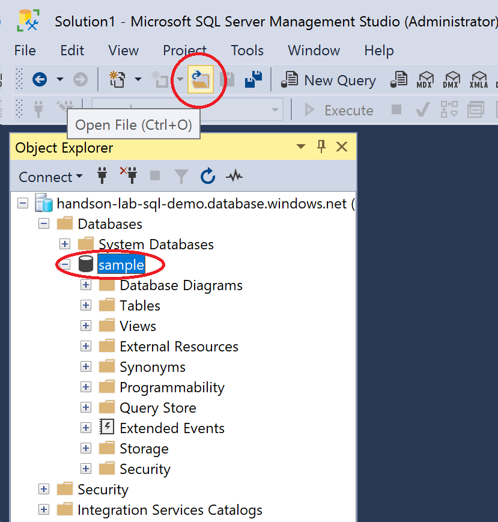

        * handson-paas-webapp\data\CREATE_TABLE.sql を開く
        

        * 実行
        

        * テーブルが作成されたことを確認
        

    2. データの投入

        * 同様にして次の2つの SQL ファイルを順に実行
        ```
        handson-paas-webapp\data
          |- INSERT_DATA_PREFECTURES.sql`
          `- INSERT_DATA_WORK.sql
        ```

    3. 結果の確認

        * sample データベースを選択した状態で「New Query」をクリック
        

        * クエリに以下を貼り付けて実行
        ```sql
        SELECT w.*, p.name FROM work as w
        INNER JOIN prefectures as p on
            w.prefectures_code = p.code
        ```

        * 次のように結果が表示されればOK
        

2. Web アプリケーションをデプロイ

    1. Visual Studio を起動

        * `handson-paas-webapp-main\app` にある ソリューションファイルをダブルクリックし、Visual Studio 2022 で開く
        


    2. ソリューションエクスプローラーでプロジェクト「WebApplication1」を右クリックし、「発行」を選択
    

    3. ターゲットは「Azure」を選択し、次へ
    

    4. 特定のターゲットは「Azure App Service (Window)」を選択し、次へ
    

    5. サインインを行う
    

    6. リリース先を選択し、完了
    （※サブスクリプションのドロップダウンがずっと処理中なってしまい選択できない場合は一度 Visual Studio を終了して再度やり直す）
    

    7. 「発行(pubxml ファイルが生成されます」を選択し、完了
    

    8. 「発行」をクリック
    

    9. 自動でブラウザが立ち上がるので問題なくデプロイされたことを確認（この画面が表示されればOK）
    

3. Database への接続情報を App Service に設定

    1. SQLデータベースへの接続文字列を取得

        1. 作成したデータベースの [設定]-[接続文字列]を開き、「ADO.NET」のタブにある接続文字列をコピーし、テキストエディタへ貼り付ける

        2. `{your_password}` の部分をご自身で設定したパスワードに修正<br />
        

    2. App Service に接続文字列を設定

        1. [設定]-[構成]のアプリケーション設定ページ内の「新しい接続文字列」をクリック
        

        2. 「接続文字列」に新しい接続文字列を追加

            | 名前             | 値                                                                                                                                                                                                                                                  |
            | ---------------- | --------------------------------------------------------------------------------------------------------------------------------------------------------------------------------------------------------------------------------------------------- |
            | `SampleDatabase` | `Server=tcp:<SQL_SERVER_NAME>.database.windows.net,1433;Initial Catalog=sample;Persist Security Info=False;User ID=<USER_NAME>;Password=<PASSWORD>;MultipleActiveResultSets=False;Encrypt=True;TrustServerCertificate=False;Connection Timeout=30;` |

            | 種類       |
            | ---------- |
            | `SQLAzure` |
            

            > note
            > 
            > `SampleDatabase` は ASP.NET プロジェクトに含まれる appsettings.json で定義した変数名
            > 

        3. 「保存」を選択<br />
            アプリケーションが自動で再起動する。


4. 動作確認

    1. デプロイした Web アプリケーション の URL を開き、「Search」タブをクリック
    

### Exercise3：App Service Private 化

Public に公開されている App Service を Private化して Internet からのアクセスを禁止し、Virutal Network からのアクセスのみ許可するようにします。


1. Private Endpoint 用の Subnet 作成

    1. 既に作成している main-vnet を開き、メニューからサブネットを選択。「＋サブネット」をクリック
    

    2. 以下の情報でサブネットを作成
        | サブネット名  | アドレス範囲  |
        | ------------- | ------------- |
        | `private-sub` | `10.0.1.0/24` |
        

1. App Service Private 化

    1. App Service のネットワークからプライベートエンドポイントをクリック
    

    2. 追加
    

    3. 以下の情報で作成

        * 名前：appservice-pe
        * 仮想ネットワーク：main-vnet
        * サブネット：private-sub
        * Private DNS ゾーンと統合する：はい
        
2. 確認

    * インターネットからのアクセスはエラーになる（自分のマシンからアクセス）
    

    * VMからHomeへアクセスすると今まで通り表示されることを確認
    

    * VMからSearchページにアクセスし、DBへの接続もできることを確認
    

### Exercise4：SQL Database Private 化 & App Service VNet 統合

まず SQL Database を Private 化 して外部からのアクセスを遮断します。これによって App Serviceからも SQL Database を参照できなくなります。
その後 App Service で VNet 統合を設定し、Virtual Network を経由して SQL Database にアクセスできるようにします。


1. SQL Database Private 化

    1. 作成した `SQL Server` を開き（データベースではなく）、[セキュリティ]-[ネットワーク]を選択。Public access の「パブリックネットワークアクセス」の「無効化」を選択し、`保存`。
    

    2. Private access の「プライベートエンドポイントを作成します」をクリック
    

    3. 下記の設定の上、作成
        * 基本
        * リソースグループ： `handson-lab-rg`
        * 名前： (任意)
        * Network Interface Name：（任意）
        * 地域： `Japan East`
        

        * リソース
        * 対象サブリソース：sqlServer
        

        * 仮想ネットワーク
        * 仮想ネットワーク：`main-vnet`
        * サブネット：`main-vnet/private-sub`
        * このサブネット内のすべてのプライベートエンドポイントに対してネットワークポリシーを有効にします。：`ON`
        

        * DNS
        * プライベート DNS ゾーンと統合する：`はい`
        * リソース グループ；`handson-lab-rg`
        

        * タグ
        * 設定なし

    4. SQL Database が Private 化したことを確認

        1. VMから Search ページにアクセスするとエラーになることを確認
        

2. App Service VNet 統合

    1. App Service を開き、[設定]-[ネットワーク]から VNET 統合をクリック
    

    2. 「VNet の追加」をクリック
    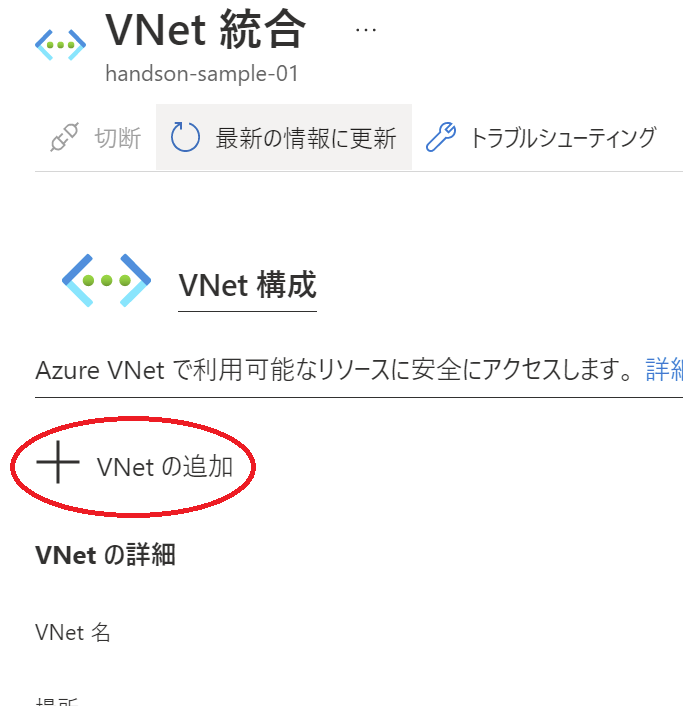

    3. 以下の内容で設定し、OK

        * 仮想ネットワーク：`main-vnet`
        * サブネット：`新しいサブネットを作成します`
        * サブネット名：`business-sub`
        * 仮想ネットワーク アドレスのブロック：`10.0.0.0/16`
        * サブネット アドレス ブロック：`10.0.2.0/24`
        
        
3. AppService からの送信トラフィックをすべて VNet へ向ける

    1. App Service の [設定]-[構成] のアプリケーション設定で「新しいアプリケーション設定」をクリック
    

    2. 以下の情報を設定し、OK
        | 名前                     | 値  |
        | ------------------------ | --- |
        | `WEBSITE_VNET_ROUTE_ALL` | `1` |
        
        

    3. 保存
    

    4. 続行
    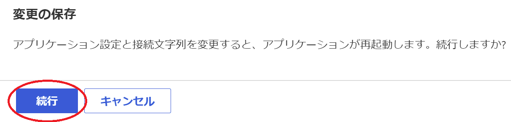

4. 確認

    * インターネットからのアクセスは引き続きエラーになる（自分のマシンからアクセス）
    

    * VMからHomeへアクセスすると今まで通り表示されることを確認
    

    * VMからSearchページにアクセスし、DBへの接続もできることを確認
    

### Exercise5：Key Vault 設定

App Service のアプリケーション設定に格納した SQL Database への接続文字列を Key Vault に移動します。


1. Key Vault を作成

    1. リソースの作成画面で「key vault」と入力し、Key Vault を検索
    

    1. 次の情報で作成

    * 基本
    * リソースグループ：`handson-lab-rg`
    * Key Vault 名：（任意）
    * 地域：Japan East
    * 価格レベル：標準
    

    1. 確認及び作成

        * アクセスポリシーとネットワーク設定は後ほど設定

2. Key Vault に DB 接続文字列をシークレットとして格納
   
   1. [設定]-[シークレット]の「生成/インポート」をクリック
    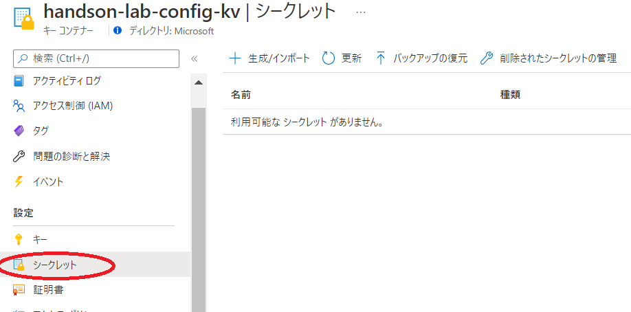

   2. 次の情報でシークレットを作成

    * アップロードオプション：手動
    * 名前：（任意）
    * 値：AppService のアプリケーション設定にセットした SQL Database の接続文字列
    

    1. 作成

    2. 作成したシークレットの識別子を取得

        * シークレットの一覧から今作成したシークレットを選択
        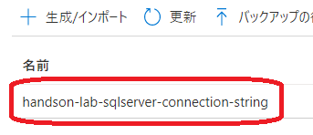

        * バージョン番号を選択
        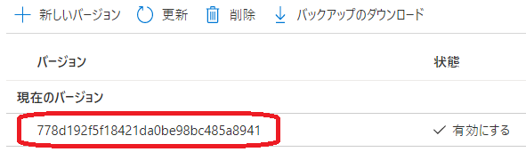

        * シークレット識別子をコピーし、メモしておく
        

3. App Service のマネージドIDを作成

    1. App Service の [設定]-[ID]のシステム割当済みページにて、状態をオンに設定してから保存
    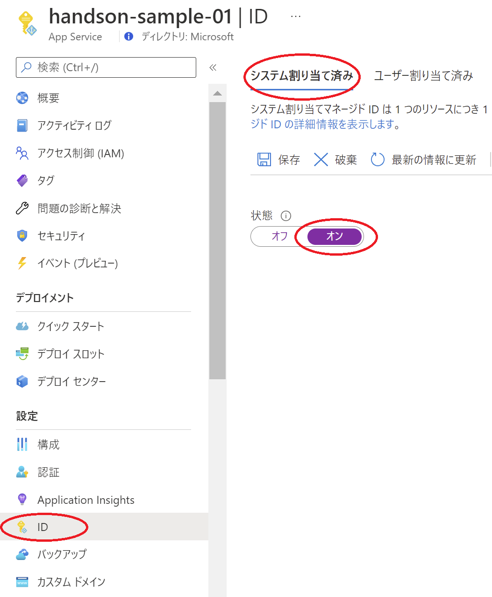

    1. 「はい」をクリック
    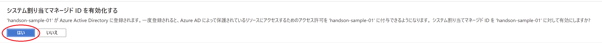

    1. マネージドID作成後の画面でオブジェクト（プリンシパル）ID をコピー
    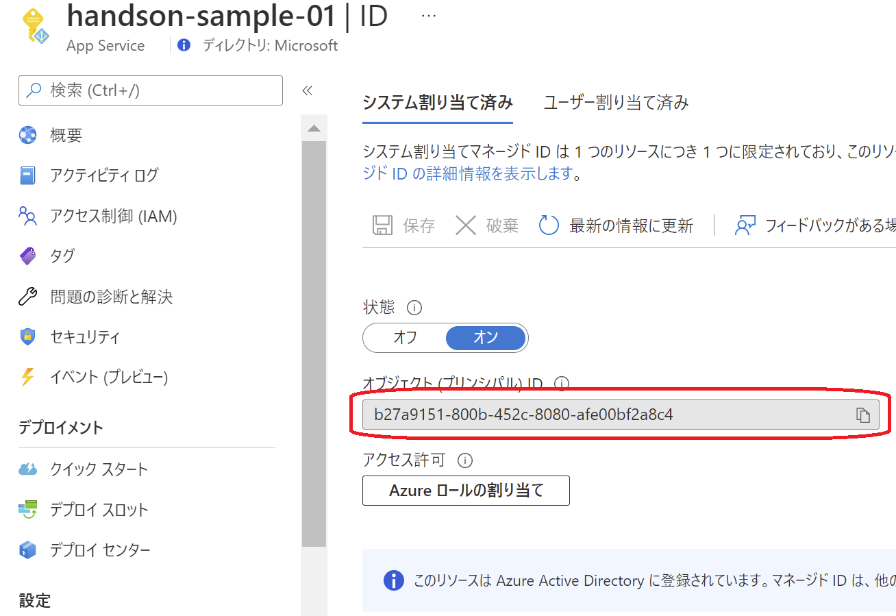

4. Key Vault のアクセスポリシーでマネージドIdにアクセス権限を付与

    1. [設定]-[アクセスポリシー]の「アクセスポリシーの追加」をクリック
    

    1. 次の情報でアクセスポリシーを追加

        * シークレットのアクセス許可で「取得」を選択
        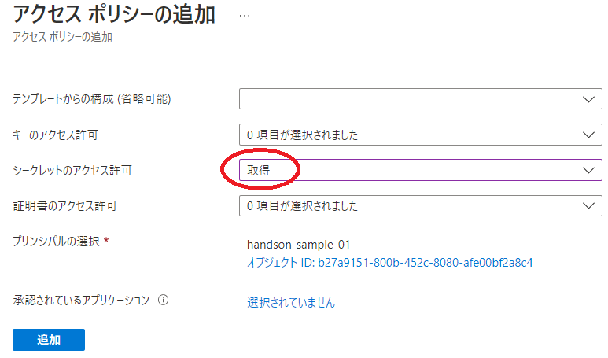

        * プリンシパルの選択をクリックし、マネージドIDのオブジェクトIDを貼り付けて検索して選択
        

    2. 追加の後、保存

        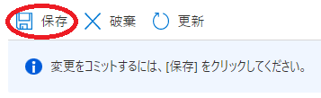

5. App Service の接続文字列を Key Vaule 経由に変更

    1. [設定]-[構成]アプリケーション設定ページにて、追加した接続文字列である SampleDatabaseの編集アイコンをクリック
    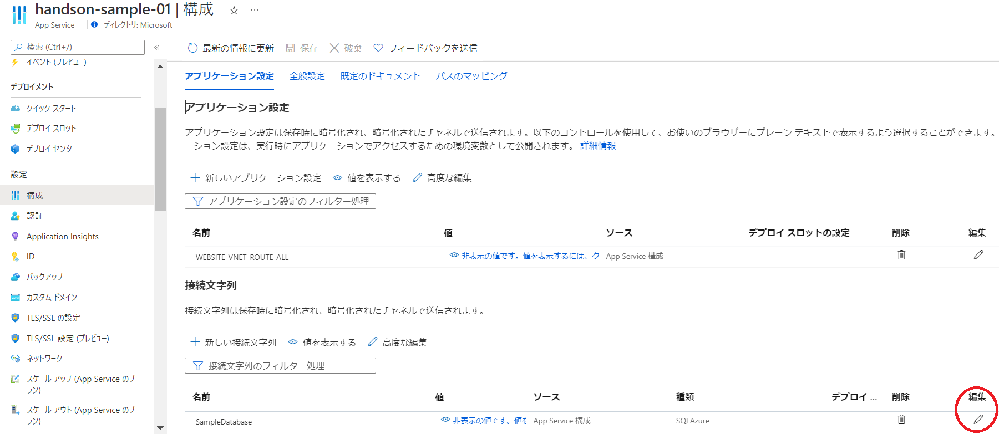

    1. 値を次のように編集

        @Microsoft.KeyVault(SecretUri=シークレット識別子)
        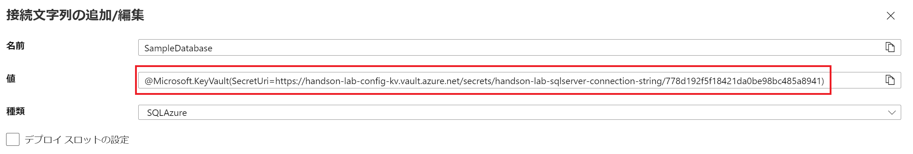

        > note
        > 
        > `シークレット識別子` は 前の手順でメモした KeyVault の「シークレット識別子」を利用する
        > 
        > `シークレット識別子` は `'"'(ダブルクォート)` で囲んだり、 `'{}'(波括弧)` で囲まないこと！


    2. 保存
    

    1. 続行
    

6. 確認

    1. 更新した接続文字列の「ソース」が「キーコンテナーの参照」となり、緑色でチェックマークがついていることを確認
    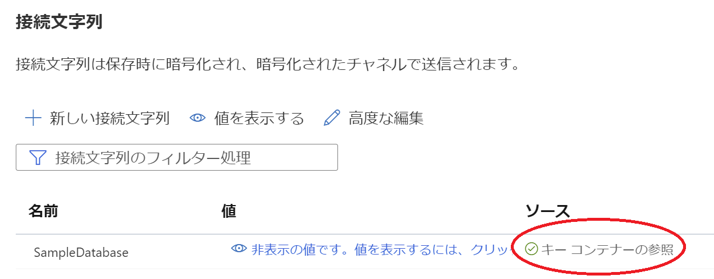

        >note
        >
        > もし緑色のチェックマークではなく、赤色の×の場合は設定した接続文字列を使用して Key Vault へのアクセスに失敗しています。設定値を見直してください。

7. Key Vault を private 化

   1. [設定]-[ネットワーク]のプライベートエンドポイント接続ページを開き、「作成」をクリック
    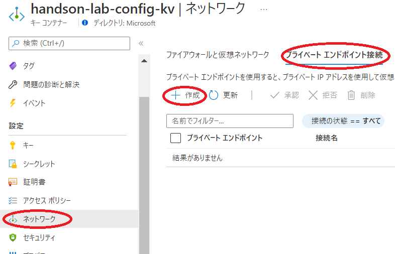

   2. 次の情報で設定

    * 基本
    * リソースグループ：`handon-lab-rg`
    * 名前：（任意）
    * Network Interface Name：（任意）
    * 地域：Japan East
    

    * リソース
    * リソースの種類：Microsoft.KeyVault/vaults
    * リソース：作成したKey Vault名
    * 対象サブリソース：vault
    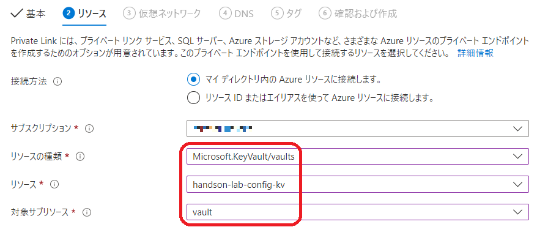

    * 仮想ネットワーク
    * 仮想ネットワーク：`main-vnet`
    * サブネット：`main-vnet/private-sub`
    * このサブネット内のすべてのプライベートエンドポイントに対してネットワークポリシーを有効にします。：オン
    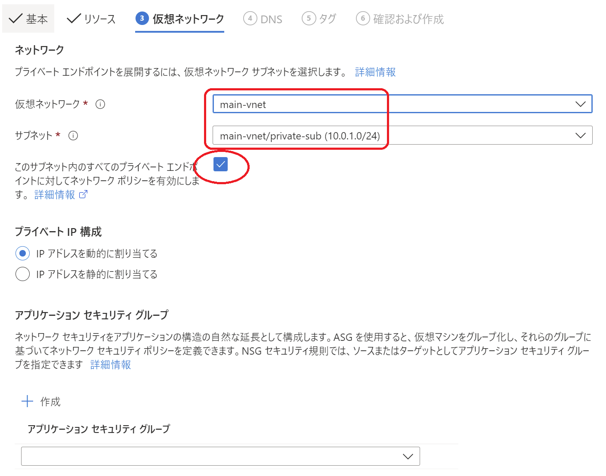

    * DNS
    * プライベート DNS ゾーンと統合する：はい
    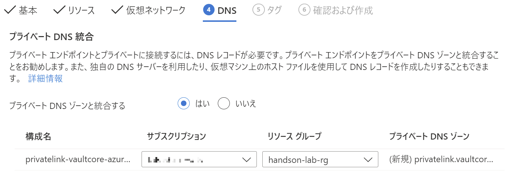

    * 確認及び作成

        作成

   3. Key Vault へのパブリックアクセスを無効化する

    1. ファイアウォールと仮想ネットワークの「パブリックアクセスの無効化」をオンにして、保存
    

    1. インターネット経由で Azure Portal の Key Vault にアクセスするとシークレットが見えないことを確認
    

8. 確認

    * インターネットからのアクセスは引き続きエラーになる（自分のマシンからアクセス）
    

    * VMからHomeへアクセスすると今まで通り表示されることを確認
    

    * VMからSearchページにアクセスし、DBへの接続もできることを確認
    

### Exercise6：（オプション）安全なアクセス


**●Just-In-Time アクセス**

1. Defender for Cloud の有効化

    1. ポータル上部の検索から `defender` を検索、 「Microsoft Defender for Cloud」 を選択

    2. [管理]-[環境設定] を開く

    3. 保護したいサブスクリプションを選択

    4. 「すべて有効にする」を選択

        

    5. 左上の「保存」を選択

2. Just-In-Time の設定

    1. ポータル上部の検索から `defender` を検索、 「Microsoft Defender for Cloud」 を選択

    2. [クラウドセキュリティ]-[ワークロード保護]を選択

    3. 「Just-In-Time VM アクセス」を選択

    4. 「仮想マシン」の「構成されていません」タブへ移動

    5. `win-vm` を選択して「1台のVMでJITを有効にする」を選択

        


    (参考) Defender for Cloud の一覧に表示されていない場合、以下の手順で個別にVM側から設定することも可能です。

    1. ポータル上部の検索から `vm` を検索、 「Virtual Machines」 を選択

    2. `win-vm` を選択

    3. [設定]-[構成]を開く

    4. 「Just-in-Time を有効にする」を選択

        

3. Just-In-Time アクセスを利用した接続

    1. ポータル上部の検索から `vm` を検索、 「Virtual Machines」 を選択

    2. `win-vm` を選択

    3. [設定]-[接続]を開く

    4. RDPタブで「接続元IPアドレス」として「自分のIP」を選択して「アクセス権の要求」を選択

        

    5. 「RDPファイルのダウンロード」を押下してRDPファイルを取得

    6. ダウンロードした RDPファイル を使って仮想マシンへアクセス

        (*) ログインに必要なユーザー名、パスワードは担当者へご確認お願いします。

**●Bastion**

1. Bastion の構築

    1. ポータル上部の検索から `bastion` を検索、 「Bastion」 を選択

    2. 左上「作成」を選択

    3. Bastionの作成

        1. 基本

            * リソースグループ： `handson-lab-rg`
            * 名前： (任意)
            * 地域： (リソースグループと同じ)
            * 仮想ネットワーク： `main-vnet`
            * サブネット： `AzureBastionSubnet` (サブネット名は固定)
            * パブリックIP： 新規作成

            

        2. タグ

            特に設定せず次へ

        3. 詳細設定

            「ネイティブクライアントサポート（プレビュー）」にチェック

            

        4. 確認および作成

            作成内容を確認して「作成」

2. Bastion を利用した接続

    1. ポータル上部の検索から `vm` を検索、 「Virtual Machines」 を選択

    2. `win-vm` を選択

    3. [操作]-[Bastion]を開く

    4. 「新しいウィンドウで開く」にチェックを入れ、「ユーザー名」「パスワード」を入力して「接続」を選択
    
        (*) ポップアップブロックされた場合、「許可」して再度実行する

        


    (参考) ローカルに az コマンドがインストールされている場合、以下のコマンド(PowerShell)でネイティブログインが可能。

    ```
    $SUBSCRIPTION_ID="<YOUR_SUBSCRIPTION_ID>"
    $RESOUCE_GROUP_NAME="handson-lab-rg"
    $BASTION_NAME="<YOUR_BASTION_NAME>"
    $VM_NAME="win-vm"
    $VM_ID=/subscriptions/$SUBSCRIPTION_ID/resourceGroups/$RESOUCE_GROUP_NAME/providers/Microsoft.Compute/virtualMachines/$VM_NAME

    az login
    az account set -s $SUBSCRIPTION_ID
    az network bastion rdp --name "$BASTION_NAME" --resource-group "$RESOUCR_GROUP_NAME" --target-resource-id "$VM_ID"
    ```


---